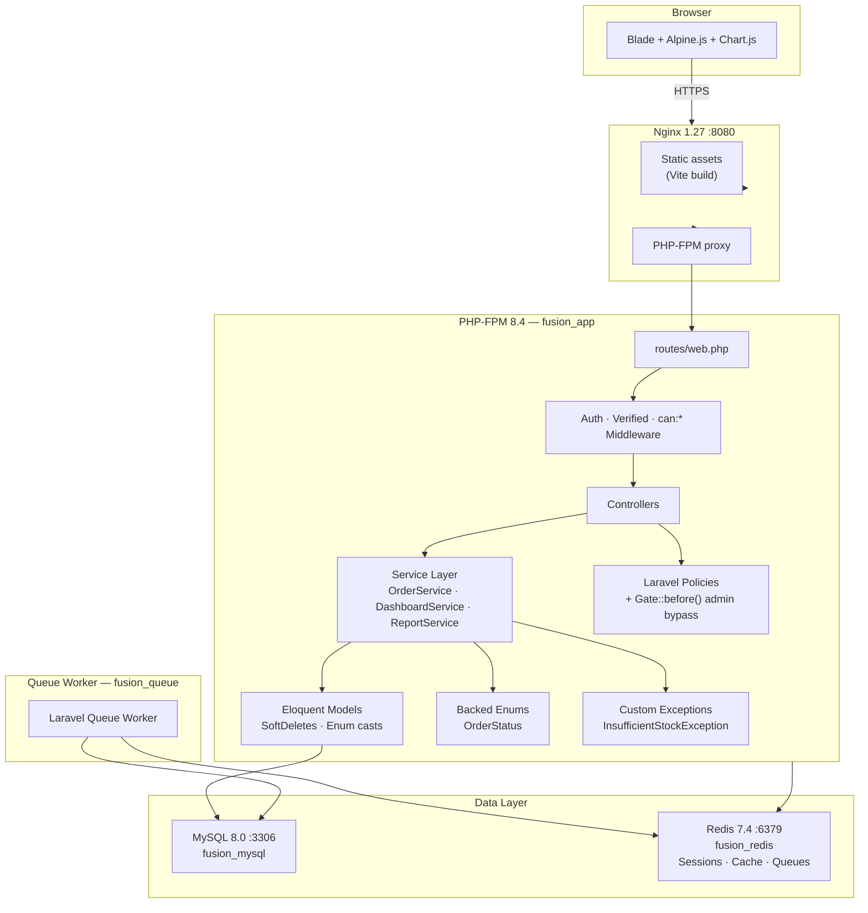
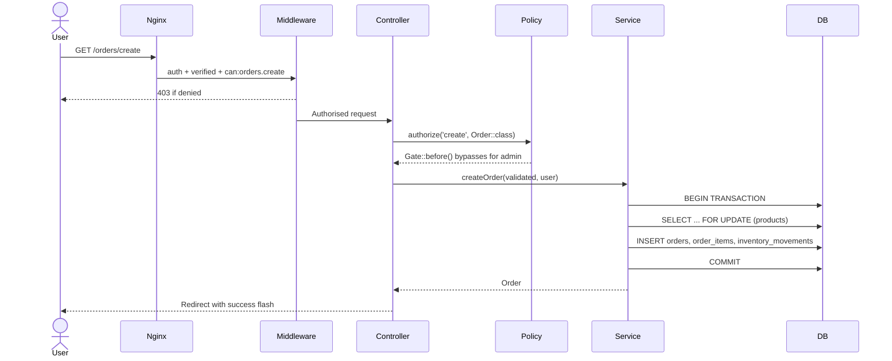
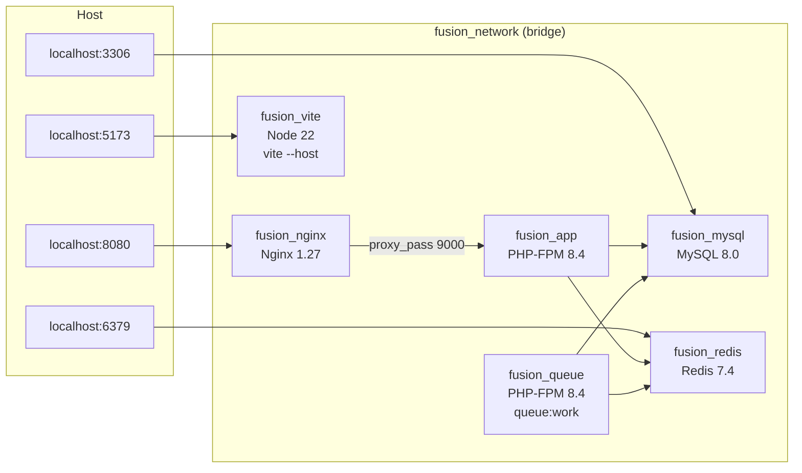
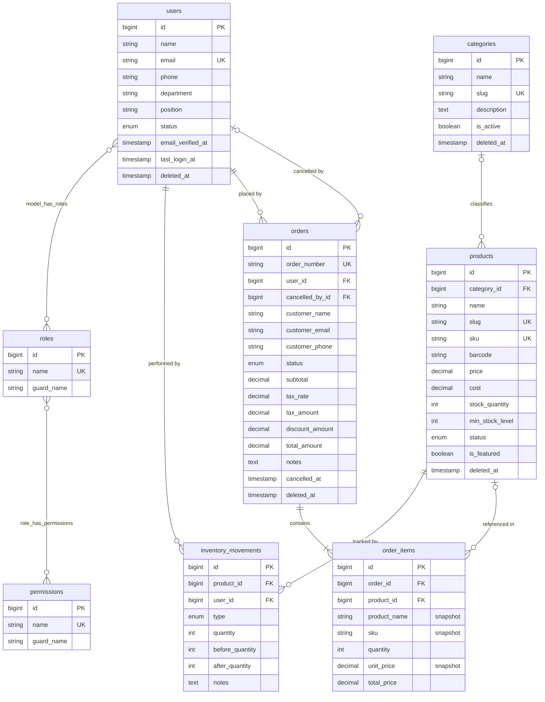
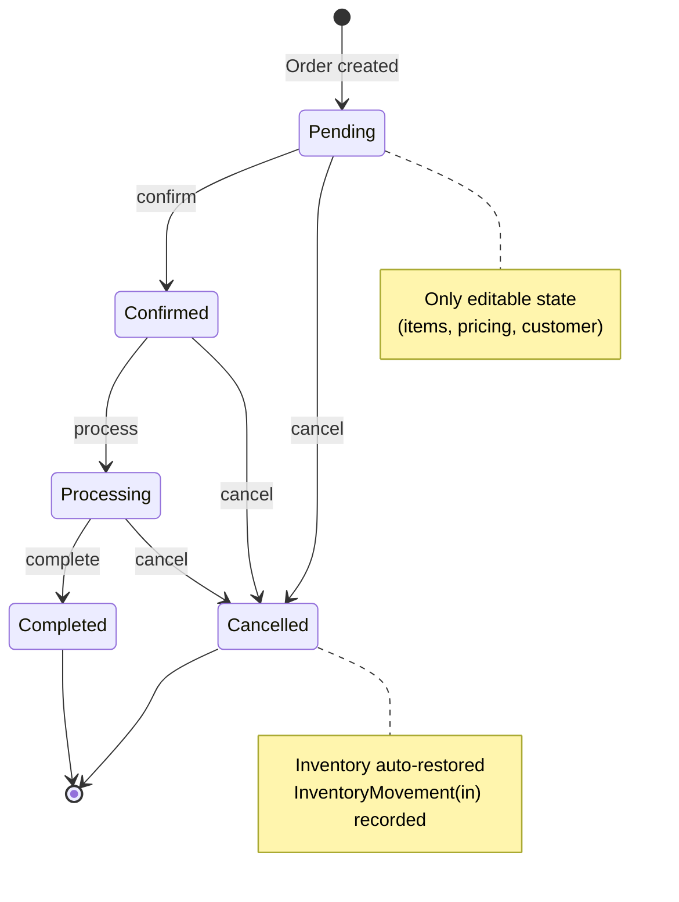

# FusionERP

A production-ready Enterprise Resource Planning (ERP) system built with Laravel 12, featuring complete modules for user management, product & inventory control, order processing, and business intelligence reporting.

---

## Table of Contents

- [Project Overview](#project-overview)
- [Objectives](#objectives)
- [Tech Stack](#tech-stack)
- [System Architecture](#system-architecture)
- [Database Schema](#database-schema)
- [Features & Modules](#features--modules)
- [Role & Permission Matrix](#role--permission-matrix)
- [Getting Started](#getting-started)
- [Test Suite](#test-suite)
- [Default Credentials](#default-credentials)

---

## Project Overview

FusionERP is a full-featured web-based ERP system designed to manage the core operations of a small-to-medium business. It provides a unified platform for managing employees, products, stock levels, sales orders, and business performance — all behind a fine-grained role-based access control system.

The system is architected around strict module boundaries: each functional area (inventory, orders, reports) is self-contained with its own controller, service layer, policies, and tests. All stock-modifying operations run inside database transactions with row-level locking to guarantee consistency under concurrent load.

---

## Objectives

- Provide a single-pane-of-glass for operations: users, products, stock, orders, and reporting
- Enforce business rules at the domain layer (services, enums, custom exceptions) — not just at the HTTP layer
- Guarantee inventory integrity: every stock change is recorded as an immutable `InventoryMovement` audit record
- Protect historical order data: product name, SKU, and price are snapshotted on each order line at creation time
- Scale gracefully: all aggregate report queries use `selectRaw` with server-side grouping — no in-PHP collection processing
- Ship with a comprehensive test suite that runs against a real SQLite in-memory database (no mocks)

---

## Tech Stack

| Layer | Technology |
|---|---|
| Language | PHP 8.4+ (strict types, readonly properties, backed enums) |
| Framework | Laravel 12 |
| RBAC | Spatie Laravel Permission v6 |
| Database | MySQL 8.0 (production) · SQLite :memory: (tests) |
| Cache / Queue | Redis 7.4 |
| Frontend | TailwindCSS 3 · Alpine.js 3 · Chart.js 4 |
| Build | Vite 7 |
| Web Server | Nginx 1.27 |
| PHP Runtime | PHP-FPM 8.4 Alpine |
| Containerisation | Docker Compose |

---

## System Architecture

### Application Architecture

### Request Flow

### Docker Compose Topology

---

## Database Schema

### Entity Relationship Diagram

### Order State Machine

---