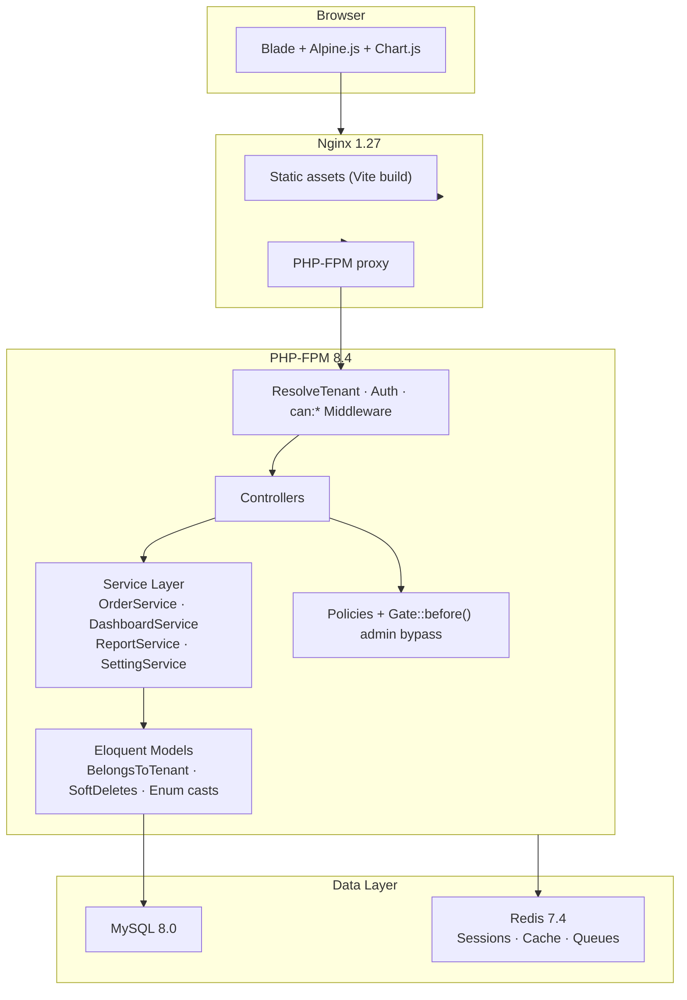
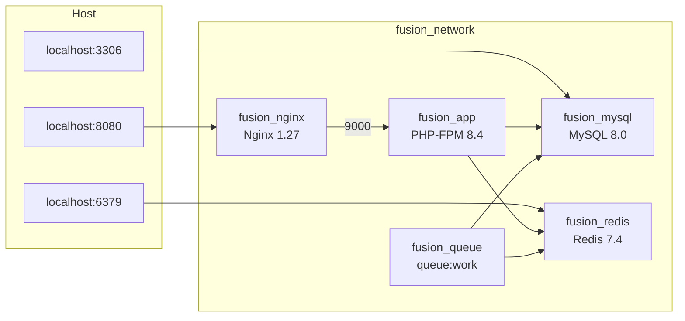
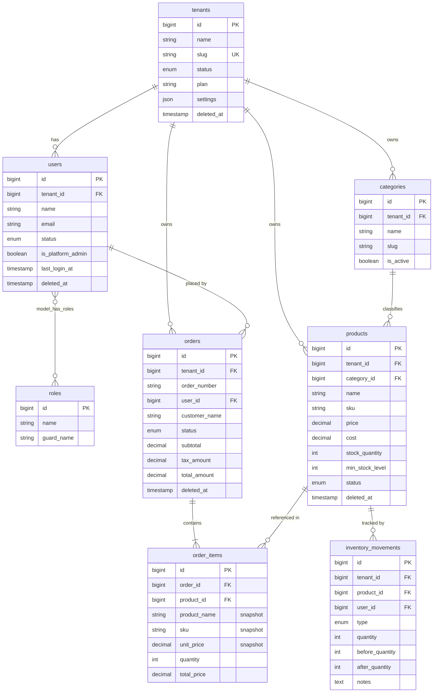
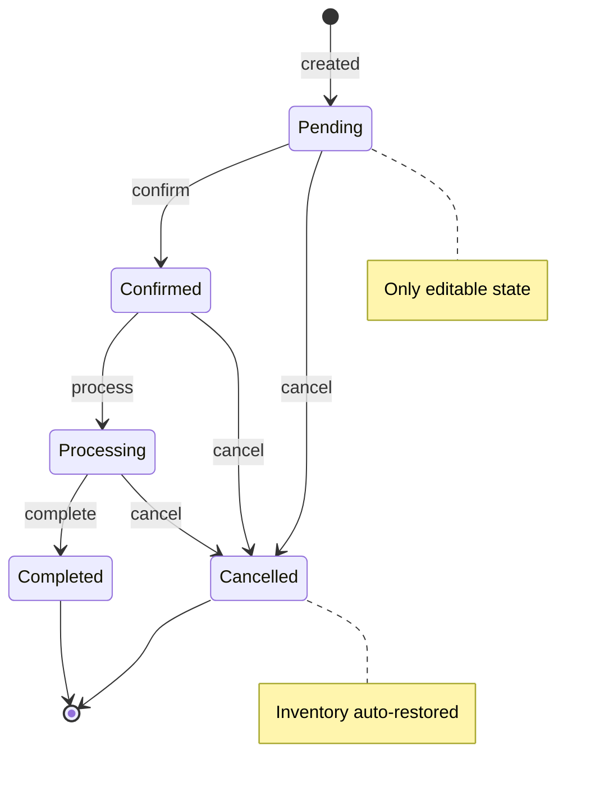

# FusionERP

A production-ready, multi-tenant Enterprise Resource Planning system built with Laravel 12. Each company gets its own isolated ERP instance accessed via subdomain. A platform super-admin dashboard manages all tenants from one place.


---

## Table of Contents

- [Project Overview](#project-overview)
- [Tech Stack](#tech-stack)
- [Architecture](#architecture)
  - [Multi-Tenancy](#multi-tenancy)
  - [Application Layers](#application-layers)
  - [Docker Topology](#docker-topology)
- [Database Schema](#database-schema)
- [Modules](#modules)
- [Role & Permission Matrix](#role--permission-matrix)
- [CI / CD Pipeline](#ci--cd-pipeline)
- [Getting Started — Local](#getting-started--local)
- [Production Deployment](#production-deployment)
- [Test Suite](#test-suite)
- [Default Credentials](#default-credentials)

---

## Project Overview

FusionERP is a full-featured web-based ERP designed for small-to-medium businesses. Companies register independently; each gets its own subdomain (e.g. `acme.localhost:8080`) and a fully isolated data environment on a shared database. A platform super-admin at `/admin` can oversee and manage all tenant companies from a single dashboard.

**Core design principles:**

- Tenant isolation via `TenantScope` Eloquent global scope — cross-tenant data leaks are structurally impossible
- Business rules enforced in the service layer (transactions, row-level locks, custom exceptions) — not just at the HTTP boundary
- Inventory integrity: every stock change produces an immutable `InventoryMovement` audit record
- Historical accuracy: product name, SKU, and price are snapshotted on each order line at creation
- No mocks in tests — all 224 tests run against a real SQLite in-memory database

---

## Tech Stack

| Layer | Technology |
|---|---|
| Language | PHP 8.4+ (strict types, readonly properties, backed enums) |
| Framework | Laravel 12 |
| RBAC | Spatie Laravel Permission v6 |
| Database | MySQL 8.0 (production) · SQLite :memory: (tests) |
| Cache / Queue | Redis 7.4 |
| Frontend | Tailwind CSS 3 · Alpine.js 3 · Chart.js 4 |
| Build | Vite 7 |
| Web Server | Nginx 1.27 |
| PHP Runtime | PHP-FPM 8.4 Alpine |
| Containerisation | Docker Compose |
| CI / CD | GitHub Actions → Docker Hub → SSH deploy |

---

## Architecture

### Multi-Tenancy

FusionERP uses a **shared database, shared schema** multi-tenancy model with subdomain routing.

```
http://acme.localhost:8080   →  ResolveTenant middleware  →  binds Tenant('acme') into container
http://beta.localhost:8080   →  ResolveTenant middleware  →  binds Tenant('beta') into container
http://localhost:8080/admin  →  EnsurePlatformAdmin middleware  →  platform dashboard (no tenant)
```

Every tenant-scoped model uses the `BelongsToTenant` trait which:
- Automatically applies `tenant_id = current_tenant` as a global Eloquent scope
- Sets `tenant_id` from the container-bound tenant on `creating`

`Gate::before()` grants admin users full access within their own tenant only.

### Application Layers



### Docker Topology



---

## Database Schema



### Order State Machine



---

## Modules

| # | Module | Key Features |
|---|---|---|
| 0 | **Auth** | Registration creates tenant + assigns admin role; email auto-verified; subdomain flashed on first login |
| 1 | **Users** | CRUD, soft delete, restore, role assignment, password reset, per-tenant isolation |
| 2 | **Roles & Permissions** | Custom roles with granular permissions; admin bypass via `Gate::before()` |
| 3 | **Products** | CRUD with category, SKU, barcode, cost/price, status; soft delete & restore |
| 4 | **Categories** | Hierarchical-ready categories with slugs; soft delete |
| 5 | **Inventory** | Stock adjustments (in/out/correction), movement audit log, low-stock alerts |
| 6 | **Orders** | Full order lifecycle, line-item snapshots, tax/discount, cancel with stock restore |
| 7 | **Reports** | Sales report, inventory report, CSV export; server-side aggregation |
| 8 | **Settings** | Per-tenant config (general, orders, preferences); stored in `tenants.settings` JSON column |
| — | **Platform Admin** | Super-admin dashboard: all companies, stats, user lists, restore archived tenants |

