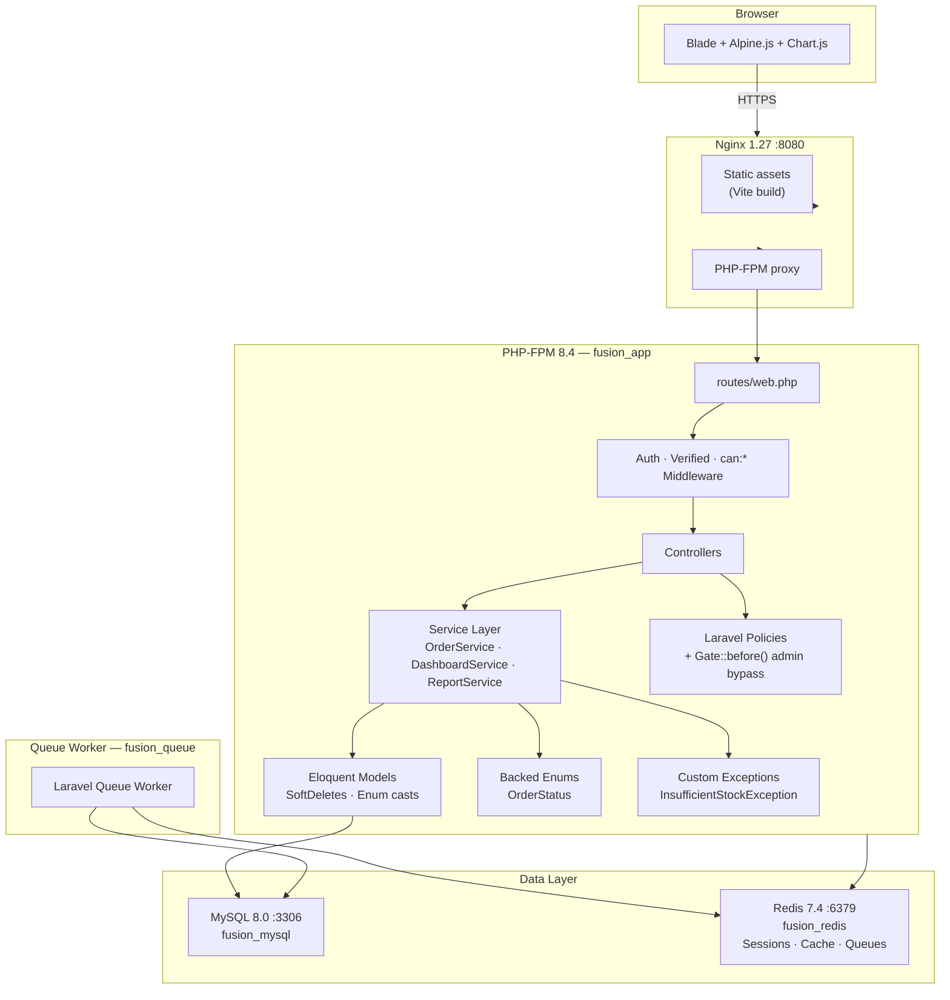
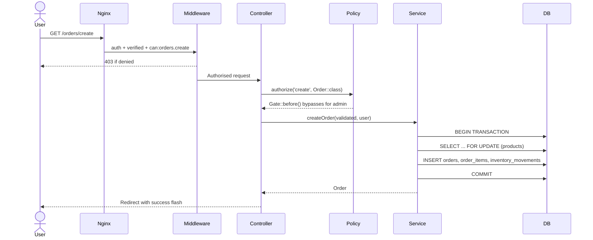
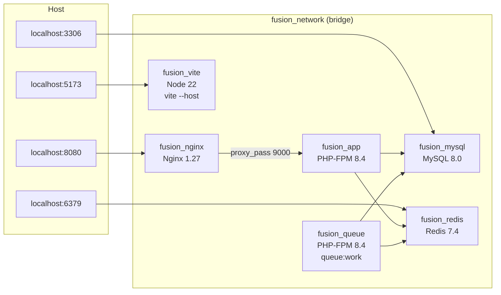
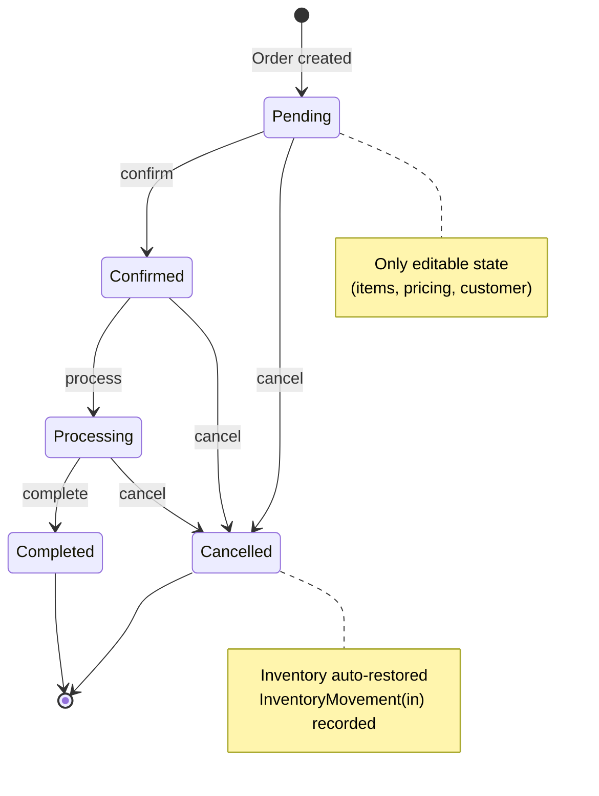

# FusionERP

A production-ready Enterprise Resource Planning (ERP) system built with Laravel 12, featuring complete modules for user management, product & inventory control, order processing, and business intelligence reporting.

---

## Table of Contents

- [Project Overview](#project-overview)
- [Objectives](#objectives)
- [Tech Stack](#tech-stack)
- [System Architecture](#system-architecture)
- [Database Schema](#database-schema)
- [Features & Modules](#features--modules)
- [Role & Permission Matrix](#role--permission-matrix)
- [Getting Started](#getting-started)
- [Test Suite](#test-suite)
- [Default Credentials](#default-credentials)

---

## Project Overview

FusionERP is a full-featured web-based ERP system designed to manage the core operations of a small-to-medium business. It provides a unified platform for managing employees, products, stock levels, sales orders, and business performance — all behind a fine-grained role-based access control system.

The system is architected around strict module boundaries: each functional area (inventory, orders, reports) is self-contained with its own controller, service layer, policies, and tests. All stock-modifying operations run inside database transactions with row-level locking to guarantee consistency under concurrent load.

---

## Objectives

- Provide a single-pane-of-glass for operations: users, products, stock, orders, and reporting
- Enforce business rules at the domain layer (services, enums, custom exceptions) — not just at the HTTP layer
- Guarantee inventory integrity: every stock change is recorded as an immutable `InventoryMovement` audit record
- Protect historical order data: product name, SKU, and price are snapshotted on each order line at creation time
- Scale gracefully: all aggregate report queries use `selectRaw` with server-side grouping — no in-PHP collection processing
- Ship with a comprehensive test suite that runs against a real SQLite in-memory database (no mocks)

---

## Tech Stack

| Layer | Technology |
|---|---|
| Language | PHP 8.4+ (strict types, readonly properties, backed enums) |
| Framework | Laravel 12 |
| RBAC | Spatie Laravel Permission v6 |
| Database | MySQL 8.0 (production) · SQLite :memory: (tests) |
| Cache / Queue | Redis 7.4 |
| Frontend | TailwindCSS 3 · Alpine.js 3 · Chart.js 4 |
| Build | Vite 7 |
| Web Server | Nginx 1.27 |
| PHP Runtime | PHP-FPM 8.4 Alpine |
| Containerisation | Docker Compose |

---

## System Architecture

### Application Architecture



### Request Flow



### Docker Compose Topology



---

## Database Schema

### Entity Relationship Diagram

```mermaid
erDiagram
    users {
        bigint id PK
        string name
        string email UK
        string phone
        string avatar
        string department
        string position
        enum status "active|inactive|suspended"
        timestamp email_verified_at
        timestamp last_login_at
        string password
        timestamp deleted_at
        timestamps
    }

    roles {
        bigint id PK
        string name UK
        string guard_name
        timestamps
    }

    permissions {
        bigint id PK
        string name UK
        string guard_name
        timestamps
    }

    model_has_roles {
        bigint role_id FK
        string model_type
        bigint model_id
    }

    model_has_permissions {
        bigint permission_id FK
        string model_type
        bigint model_id
    }

    role_has_permissions {
        bigint permission_id FK
        bigint role_id FK
    }

    categories {
        bigint id PK
        string name
        string slug UK
        text description
        boolean is_active
        timestamp deleted_at
        timestamps
    }

    products {
        bigint id PK
        bigint category_id FK
        string name
        string slug UK
        string sku UK
        string barcode
        text description
        decimal price
        decimal cost
        int stock_quantity
        int min_stock_level
        string image
        enum status "active|inactive|draft"
        boolean is_featured
        timestamp deleted_at
        timestamps
    }

    inventory_movements {
        bigint id PK
        bigint product_id FK
        bigint user_id FK
        enum type "in|out|adjustment"
        int quantity
        int before_quantity
        int after_quantity
        text notes
        timestamps
    }

    orders {
        bigint id PK
        string order_number UK
        bigint user_id FK
        string customer_name
        string customer_email
        string customer_phone
        enum status "pending|confirmed|processing|completed|cancelled"
        decimal subtotal
        decimal tax_rate
        decimal tax_amount
        decimal discount_amount
        decimal total_amount
        text notes
        timestamp cancelled_at
        bigint cancelled_by_id FK
        timestamp deleted_at
        timestamps
    }

    order_items {
        bigint id PK
        bigint order_id FK
        bigint product_id FK
        string product_name "snapshot"
        string sku "snapshot"
        int quantity
        decimal unit_price "snapshot"
        decimal total_price
        timestamps
    }

    users ||--o{ model_has_roles : "assigned"
    roles ||--o{ model_has_roles : "has"
    roles ||--o{ role_has_permissions : "grants"
    permissions ||--o{ role_has_permissions : "belongs to"
    categories ||--o{ products : "classifies"
    products ||--o{ inventory_movements : "tracked by"
    users ||--o{ inventory_movements : "performed by"
    users ||--o{ orders : "places"
    orders ||--o{ order_items : "contains"
    products ||--o{ order_items : "referenced in"
    users ||--o{ orders : "cancels"
```

### Order State Machine



---

## Features & Modules

### Module 0 — Foundation
- Docker Compose stack: Nginx, PHP-FPM, MySQL, Redis, Vite, Queue worker
- Laravel 12 with strict types, PHP 8.4+
- TailwindCSS + Alpine.js + Vite 7 build pipeline
- Shared app layout (`x-app-layout`) with page title slot, header action slot, and `@push('scripts')` stack
- Custom CSS component classes: `.btn-primary`, `.btn-danger`, `.form-input`, `.badge-green`, `.table-th`, etc.

### Module 1 — Authentication (39 tests)
- Email + password login with remember-me
- Email verification gate
- Fortify-based password reset via email
- Rate-limited login attempts
- Profile edit (name, email, password, avatar)
- Secure logout

### Module 2 — User Management (32 tests)
- Admin CRUD for user accounts
- Search by name / email
- Paginated user list
- Role assignment at create/edit
- Soft delete + restore
- Admin-triggered password reset email
- `UserPolicy` with per-permission gates

### Module 3 — Role & Permission Management (23 tests)
- Full CRUD on roles (admin only)
- Assign / revoke permissions per role via checkbox UI
- Permission grouped by module in the UI
- `Gate::before()` admin bypass — admin skips all policy checks
- `Gate::policy()` explicit registration for all models

### Module 4 — Product Management (21 tests)
- Product CRUD with image upload (public disk)
- Auto-generated slug with collision avoidance
- Category assignment (nullable)
- SKU / barcode fields
- Price + cost tracking
- Soft delete + restore
- Status: `active | inactive | draft`
- `ProductPolicy` gating all mutations

### Module 5 — Inventory Management (27 tests)
- Stock managed **exclusively** through `InventoryMovement` records — never direct product edits
- Adjustment types: `add`, `subtract`, `set`
- `subtract` is floor-clamped to 0 (never goes negative)
- Full movement log with product and type filters
- Low-stock / out-of-stock dashboard stats
- Initial stock movement created on product creation
- Order cancellation auto-restores stock via `InventoryMovement('in')`

### Module 6 — Order Management (31 tests / 174 total at time of completion)
- Full order lifecycle: create → confirm → process → complete / cancel
- Transactional order creation with `DB::transaction()` + `SELECT … FOR UPDATE`
- `InsufficientStockException` caught at the controller boundary → user-friendly redirect
- Price, name, and SKU **snapshotted** on `order_items` at creation — product changes don't alter historical orders
- Order number format: `ORD-YYYYMM-XXXXX` (generated post-insert using the order ID)
- Order status state machine enforced via `OrderStatus::canTransitionTo()`
- `OrderPolicy`: `update()` only when status is `pending`; `cancel()` only when not completed/cancelled
- Alpine.js dynamic line-item builder with live subtotal/tax/discount calculation

### Module 7 — Reporting Dashboard (29 tests)
- **Overview report**: KPI cards (revenue this month vs last month with % change, orders, stock value), 12-month revenue trend line chart, orders-by-status doughnut, top products table
- **Sales report**: date-range filter with preset buttons (Today / 7d / 30d / 90d / This year), dual-axis bar+line revenue/orders chart, top products table, top customers table
- **Inventory report**: stock-alert KPIs, stock value by category bar chart, low-stock alert table with adjust links, recent movements log
- **CSV export**: streaming export via `fputcsv`/`php://temp` — no external packages; sales and inventory reports (admin + manager only)
- All queries use `selectRaw` server-side aggregates — no PHP-side collection processing
- Cross-database `DATE_FORMAT` / `strftime` abstraction for MySQL (production) vs SQLite (tests)
- Chart.js 4 bundled via Vite and exposed as `window.Chart`

---

## Role & Permission Matrix

| Permission | Admin | Manager | Employee |
|---|:---:|:---:|:---:|
| **Users** | | | |
| users.view | ✓ | ✓ | |
| users.create / edit / delete | ✓ | | |
| users.impersonate | ✓ | | |
| **Roles** | | | |
| roles.view / create / edit / delete | ✓ | | |
| **Products** | | | |
| products.view | ✓ | ✓ | ✓ |
| products.create / edit | ✓ | ✓ | |
| products.delete | ✓ | | |
| **Categories** | | | |
| categories.view | ✓ | ✓ | ✓ |
| categories.create / edit | ✓ | ✓ | |
| categories.delete | ✓ | | |
| **Inventory** | | | |
| inventory.view | ✓ | ✓ | ✓ |
| inventory.adjust / transfer / export | ✓ | ✓ | |
| **Orders** | | | |
| orders.view | ✓ | ✓ | ✓ |
| orders.create | ✓ | ✓ | ✓ |
| orders.edit | ✓ | ✓ | |
| orders.process / cancel | ✓ | ✓ | |
| orders.delete | ✓ | | |
| **Reports** | | | |
| reports.view | ✓ | ✓ | ✓ |
| reports.export | ✓ | ✓ | |
| **Settings** | | | |
| settings.view / edit | ✓ | | |

---

## Getting Started

### Prerequisites

- Docker Desktop (or Docker Engine + Compose v2)

### Installation

```bash
# Clone the repository
git clone <repo-url> fusionerp
cd fusionerp

# Copy environment file
cp .env.example .env

# Build and start all containers
docker compose up -d --build

# Generate application key
docker exec fusion_app php artisan key:generate

# Run migrations and seed default data
docker exec fusion_app php artisan migrate --seed
```

The app will be available at **http://localhost:8080**.

### Hot-reload (development)

The Vite dev server runs automatically in the `fusion_vite` container on port 5173. Changes to `resources/js` and `resources/css` are reflected immediately.

### Useful commands

```bash
# Run all tests
docker exec fusion_app php artisan test --no-coverage

# Run a specific test file
docker exec fusion_app php artisan test tests/Feature/ReportingTest.php

# Tail application logs
docker exec fusion_app tail -f storage/logs/laravel.log

# Access Tinker REPL
docker exec -it fusion_app php artisan tinker

# Clear all caches
docker exec fusion_app php artisan optimize:clear

# Rebuild frontend assets
docker exec fusion_vite npm run build
```

---

## Test Suite

The test suite covers all seven modules with PHPUnit running against an SQLite `:memory:` database (no MySQL dependency for tests).

| Test File | Tests | Assertions |
|---|---:|---:|
| `AuthenticationTest.php` | 39 | ~78 |
| `UserManagementTest.php` | 32 | ~80 |
| `RoleManagementTest.php` | 23 | ~55 |
| `ProductManagementTest.php` | 21 | ~55 |
| `InventoryManagementTest.php` | 27 | ~65 |
| `OrderManagementTest.php` | 31 | ~80 |
| `ReportingTest.php` | 29 | 73 |
| **Total** | **203** | **437** |

```bash
docker exec fusion_app php artisan test --no-coverage
# Tests: 203 passed (437 assertions)
```

---

## Default Credentials

| Role | Email | Password |
|---|---|---|
| Admin | admin@fusionerp.com | `Admin@123456` |
| Manager | manager@fusionerp.com | `Manager@123456` |
| Employee | employee@fusionerp.com | `Employee@123456` |

---

## License

This project is proprietary software. All rights reserved.
